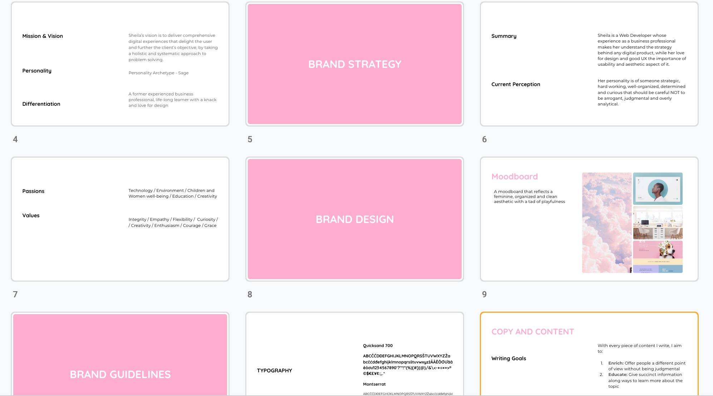
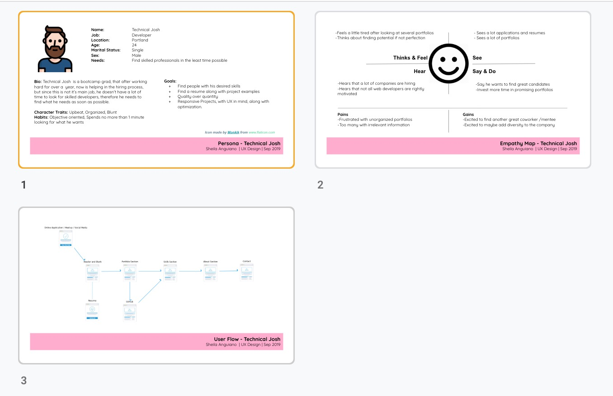
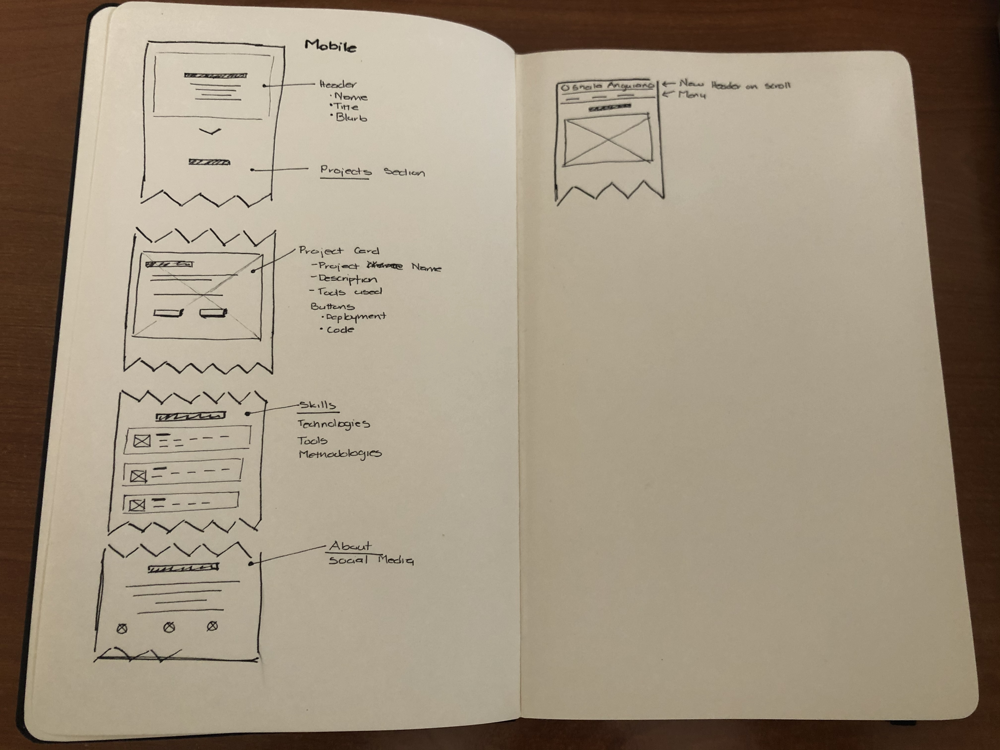

# Personal Profile
The objective of the project was to create a website that displayed curated projects along with my personality.

## Development
After a couple of failed iterations, I decided to reverse engineer my problem, which led me to create a Design Brief with several deliverables, such as personal [brand guidelines](https://docs.google.com/presentation/d/19EXftKLQUl5alcMsqcgNnRfnEHop0KhfUceYaIGXpkk/edit?usp=sharing), [UX documents](https://docs.google.com/presentation/d/1SOxOUmQY6rMY4F2Zcg4Nsz257ZbJkjwkUGpowgm5res/edit?usp=sharing) along with low fidelity wireframes using a Mobile First Approach.

## Icon Attributions
Icons made by [Dave Gandy](https://www.flaticon.com/authors/dave-gandy) from www.flaticon.com
Icons made by [Chanut](https://www.flaticon.com/authors/chanut) from www.flaticon.com
Icons made by [monkik](https://www.flaticon.com/authors/monkik) from www.flaticon.com
Icons made by [Freepik](https://www.flaticon.com/authors/freepik) from www.flaticon.com
Icons made by [Eucalyp](https://www.flaticon.com/authors/eucalyp) from www.flaticon.com